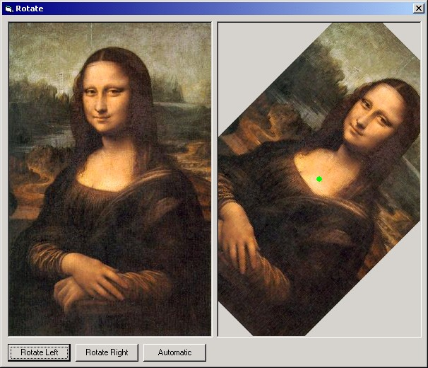



## A simple and fast way to rotate pictures

### Description

----

UPDATED 

----

There was an error for Win 95,98 and Me users, so the rotation never occurred. The code now should run nice over those platforms

A simple and fast way to rotate pictures based on its center. Uses only Windows API functions.
 
### More Info
 

             |
---                |---
**Submitted On**   |2002-03-13 00:09:46
**By**             |[Raul Fragoso](https://github.com/Planet-Source-Code/PSCIndex/blob/master/ByAuthor/raul-fragoso.md)
**Level**          |Intermediate
**User Rating**    |3.9 (31 globes from 8 users)
**Compatibility**  |VB 4\.0 \(32\-bit\), VB 5\.0, VB 6\.0
**Category**       |[Graphics](https://github.com/Planet-Source-Code/PSCIndex/blob/master/ByCategory/graphics__1-46.md)
**World**          |[Visual Basic](https://github.com/Planet-Source-Code/PSCIndex/blob/master/ByWorld/visual-basic.md)
**Archive File**   |[A\_simple\_a617103122002\.zip](https://github.com/Planet-Source-Code/raul-fragoso-a-simple-and-fast-way-to-rotate-pictures__1-32615/archive/master.zip)

